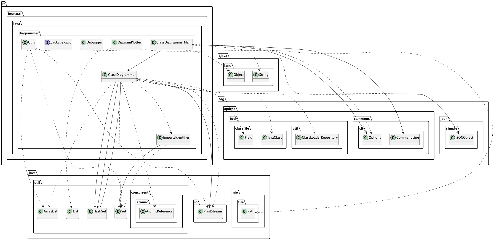
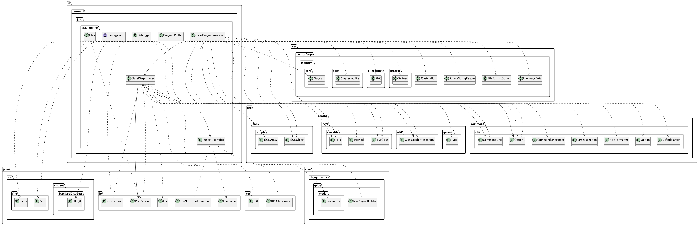
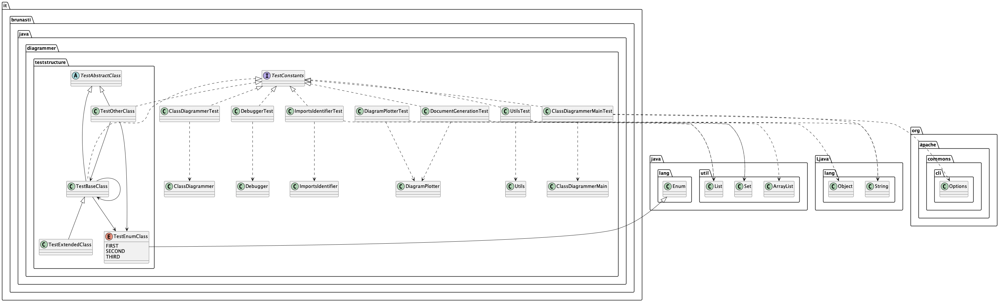

# java-diagrammer
Generate a PlantUML Class diagram from a compiled Java class collection

By Paolo Brunasti

---

## Usage

Usage via CLI

> java it.brunasti.java.diagrammer.Main -?
> 
> usage: java it.brunasti.java.diagrammer.Main [-?] [-c \<arg\>] [-d] [-h] [-o \<arg\>] [-p \<arg\>]

```
java it.brunasti.java.diagrammer.Main -h

usage: java it.brunasti.java.diagrammer.Main
    -?                          Quick Reference
    -c,--config <arg>           Configuration File
    -d,--debug                  Execute in debug mode
    -h,--help                   Help
    -i,--includeImport <arg>    Include imports as define in Java files in path
    -o,--output <arg>           Output File
    -p,--path <arg>             Classes Package path
```

---

Execution example:

Single command line execution:

> java it.brunasti.java.diagrammer.Main -p /Users/paolobrunasti/Work/Mine/java-diagrammer/java-diagrammer/target/classes -o ./temp/output.puml 


More complete command line execution, with all libraries needed:


> java 
> -classpath /Users/paolobrunasti/.m2/repository/org/ow2/asm/asm/9.6/asm-9.6.jar:/Users/paolobrunasti/.m2/repository/org/ow2/asm/asm-util/9.6/asm-util-9.6.jar:/Users/paolobrunasti/.m2/repository/org/ow2/asm/asm-tree/9.6/asm-tree-9.6.jar:/Users/paolobrunasti/.m2/repository/org/ow2/asm/asm-analysis/9.6/asm-analysis-9.6.jar -p /Users/paolobrunasti/Work/Mine/java-diagrammer/java-diagrammer/target/classes:/Users/paolobrunasti/.m2/repository/org/apache/bcel/bcel/6.5.0/bcel-6.5.0.jar:/Users/paolobrunasti/Work/Mine/java-diagrammer/java-diagrammer/lib/org.apache.commons.cli-4.3.1.jar 
> -m java.diagrammer/it.brunasti.java.diagrammer.Main 
> -p /Users/paolobrunasti/Work/Mine/java-diagrammer/java-diagrammer/target/classes 
> -o ./temp/output.puml


---

## Example of Result

Example of result of the java-diagrammer applied to itself:



Example of result of the java-diagrammer applied to itself with the Import analysis activated:



Example of result of the java-diagrammer applied to its own test classes:




--- 

## Configuration

If you don't want to include some whole java Packages or specific Classes, 
add them in the JSON configuration file which you will indicate in the command line.
Here below an example and the base structure:

ç

```
{
  "exclude": {
    "classes": [
      {
        "class": "org.joda.time.DateTime"
      }
    ],
    "packages": [
      {
        "package": "java.lang."
      },
      {
        "package": "java.util."
      }
    ]
  }
}
```


## How to reduce diagram complexity

### Exclude classes and packages with the Config file

### Create a derived diagram with "remove" statements


## How To

### Development configuration

[How to Configure the Development Environment](docs/howToConfigure.md)


## Caveat

//TODO : Write about the compiled code issue with the Enum classes....


